

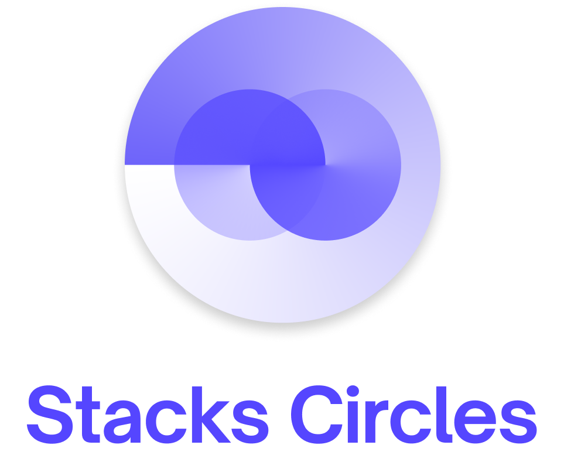

# BETA

Currently the app is in Beta, if you want to join our testing group take
a look at [Google Playstore
Testing](https://play.google.com/apps/testing/io.bloco.circles), or download and install our APK from the releases and use [our v0.1 PR for
feedback](https://github.com/blocoio/stacks-circles-app/pull/28)

# Stacks Circles Android App

The Stacks Circles App provides a native Android experience to the [Stacks ecosystem](https://www.stacks.co/). You can:

- Learn more about Stacks
- Create a Stacks account
- Manage your account identities
- Safely sign in into web and Android apps using your Stacks account

This app is open sourced. The project was made possible by the [Stacks Grants program](https://github.com/stacksgov/Stacks-Grants/issues/22) and is currently maintained by [Bloco](http://bloco.io/).

## Design

The design follows both the Stacks and Material UI/UX guidelines and it is also
open source, for future improvements and feedback. You can see the design project in [figma](https://www.figma.com/file/RQy9bq4EX4Pz4bWP9r01cQ/%F0%9F%93%B1-Blockstack-Auth-Android-App?node-id=95%3A0).

# Screenshots

 <table style="width:80%">
  <tr>
    <td>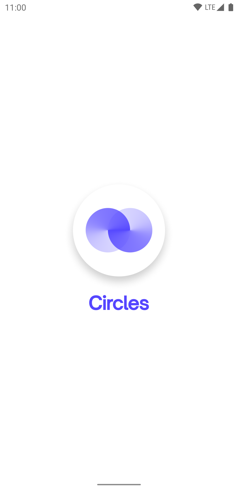</td>
    <td>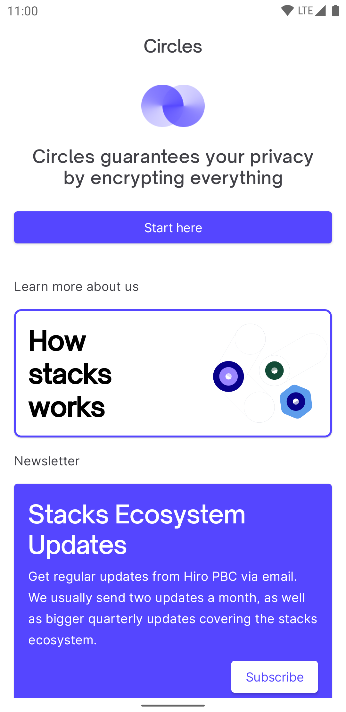</td>
    <td>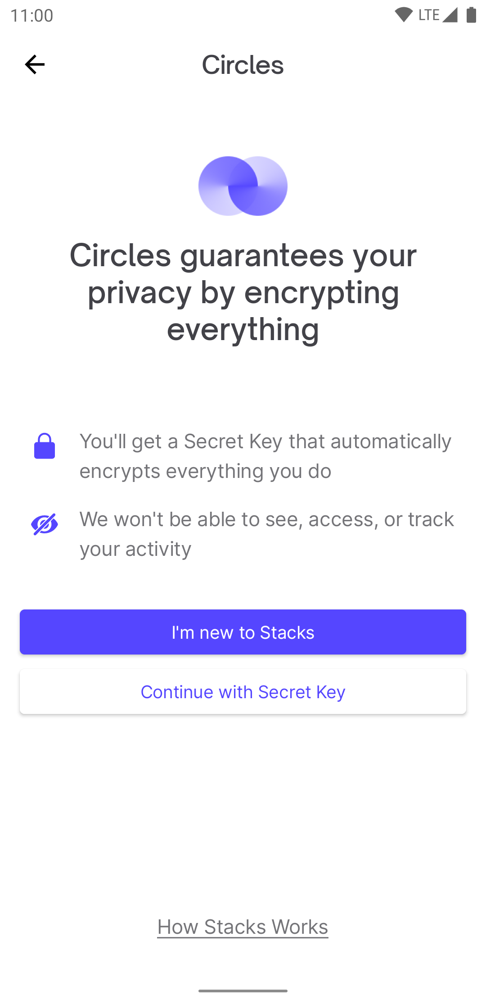</td>
  </tr>
  <tr>
    <td>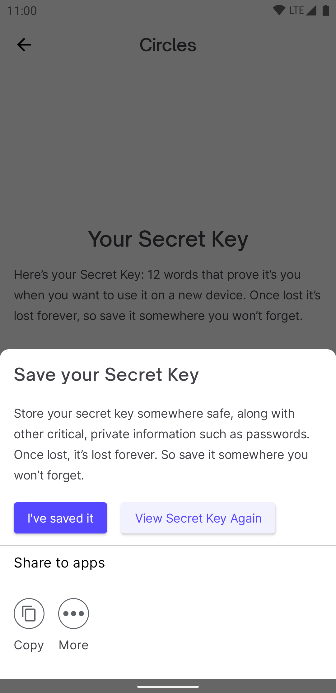</td>
    <td>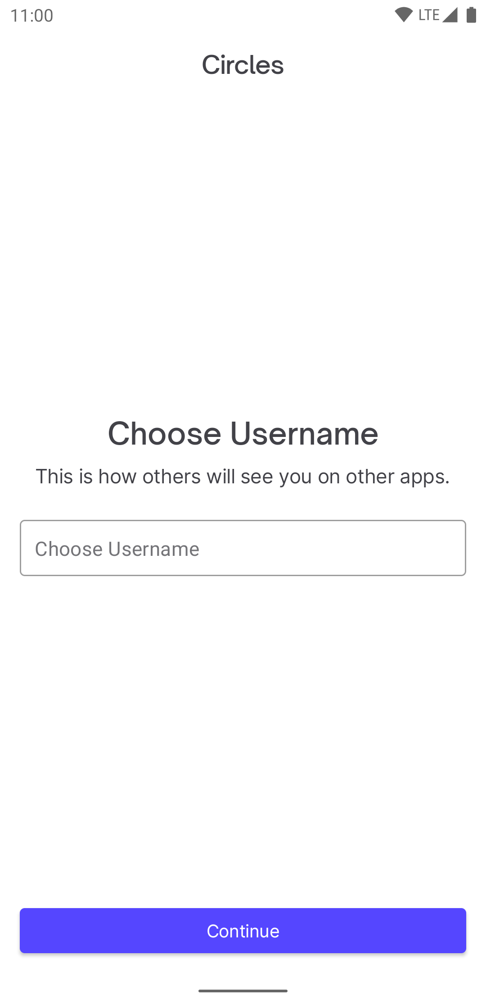</td>
    <td></td>
  </tr>
  <tr>
    <td>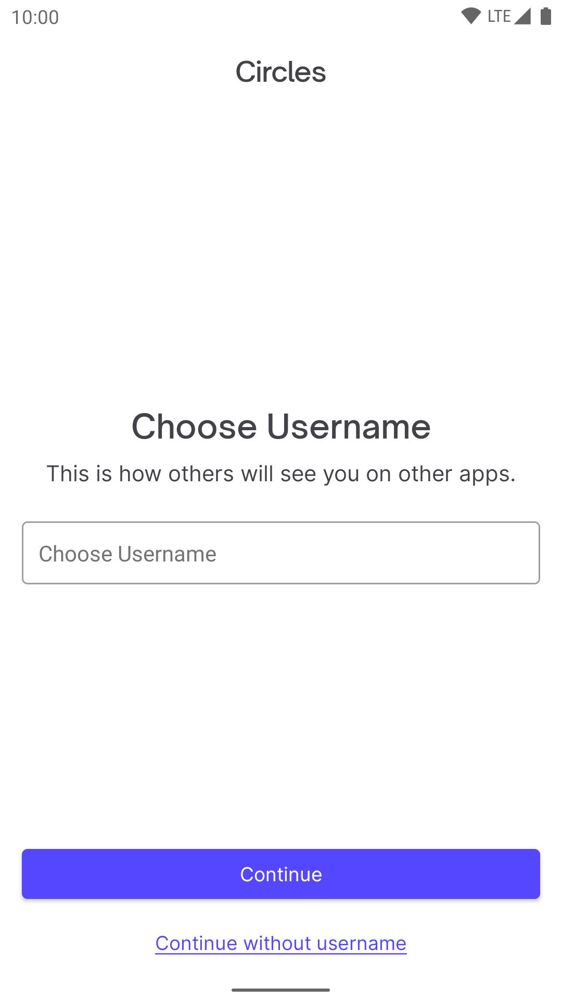</td>
    <td>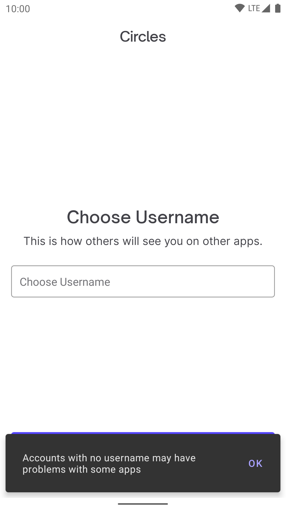</td>
    <td>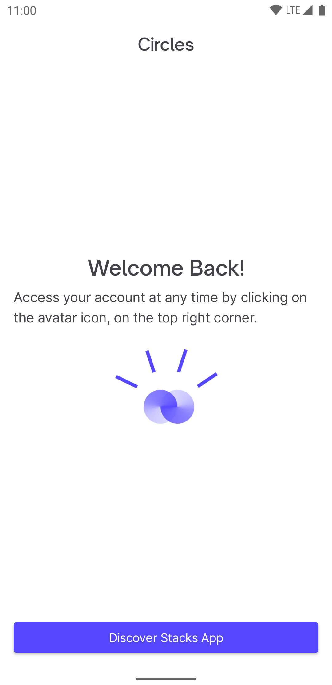</td>
  </tr>
  <tr>
    <td>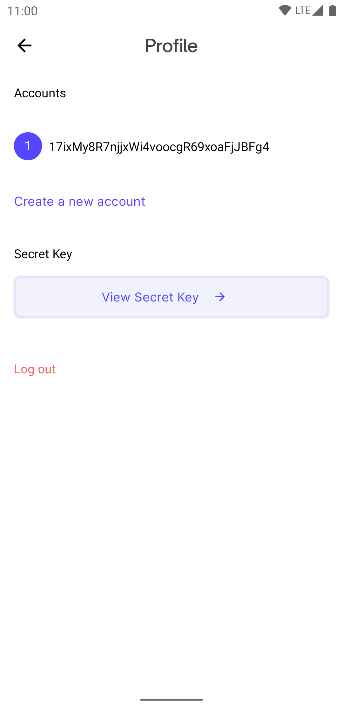</td>
    <td></td>
    <td></td>
  </tr>
</table> 

# Demo Video

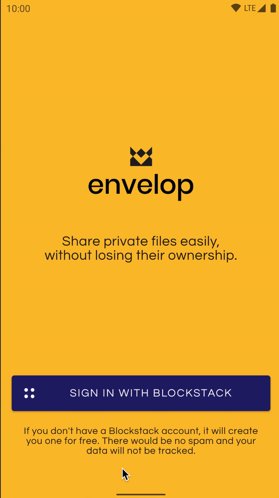
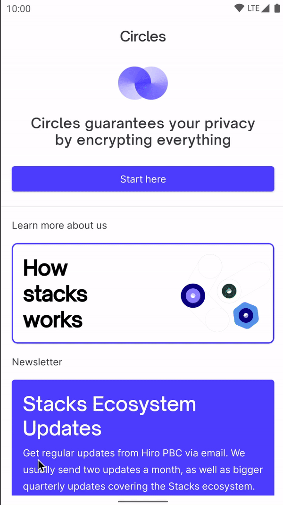

# Usage

For authenticating other apps, this app intercepts the `app.blockstack.org` URL. This way, it is  compatible with Android apps using the [Blockstack SDK](https://github.com/blockstack/blockstack-android) and web applications using [stacks.js](https://github.com/blockstack/ux).

If an account is already configured, the user simply needs to pick an Identity (or create a new one) to complete the Authentication with other apps. If no account is configured the user can
also complete the Login/Signup experience within the app to complete the Authentication.

# Roadmap

The current [Milestones](https://github.com/blocoio/stacks-circles-app/milestones?state=open) and [projects](https://github.com/blocoio/stacks-circles-app/projects) can be found in this repo.

## Future Goals:

- Support legacy recovery keys
- Dark Theme Support

# **Notes**

This project was built using [Bloco.io Android Template](https://github.com/blocoio/android-template) and follows it's clean architecture pattern. We recommend you take a look at it and its [article](https://www.bloco.io/blog/2020/android-app-starter-update) if you want to contribute.
